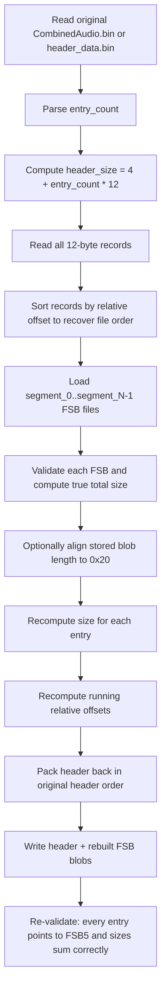

```mermaid
flowchart TD
    A[Read original CombinedAudio.bin or header_data.bin] --> B[Parse entry_count]
    B --> C[Compute header_size = 4 + entry_count * 12]
    C --> D[Read all 12-byte records]
    D --> E[Sort records by relative offset to recover file order]
    E --> F[Load segment_0..segment_N-1 FSB files]
    F --> G[Validate each FSB and compute true total size]
    G --> H[Optionally align stored blob length to 0x20]
    H --> I[Recompute size for each entry]
    I --> J[Recompute running relative offsets]
    J --> K[Pack header back in original header order]
    K --> L[Write header + rebuilt FSB blobs]
    L --> M[Re-validate: every entry points to FSB5 and sizes sum correctly]
```
